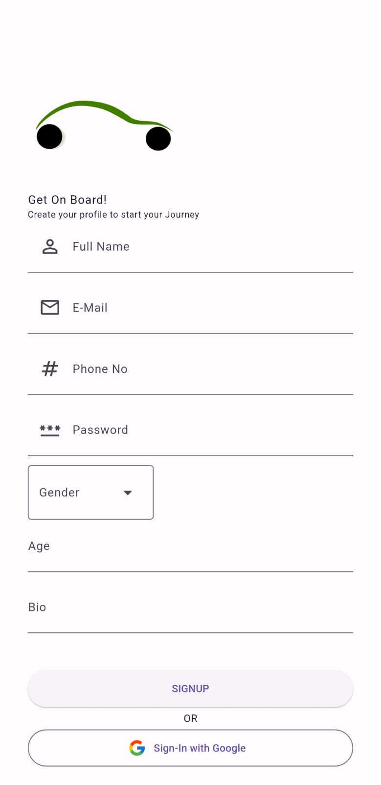
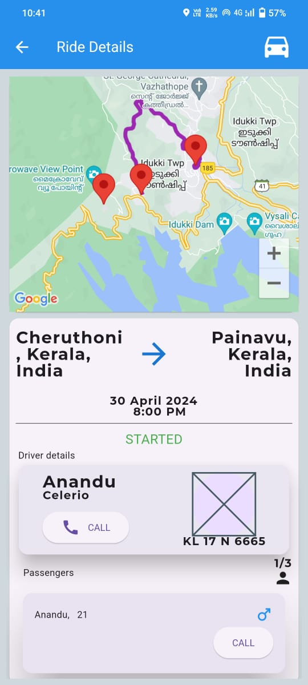

# vaayo

A new Flutter project.

## Getting Started

This is a Simple Flutter Firebase project by myself.
It is simple and not so well organised as far as professional projects go. For this is my first mobile app. Learned Lots.

To run/build this app, you need a flutter sdk version with your developement IDE and resolve dependencies.
To intitialize the app, there are multiple changes to be done such as,
  - Initialize a new firebase project 
  - Change firebaseoptions.dart according to the new project created 
  - Create a Google Cloud Console account if ome does not exist already
  - Enable Maps SDK for android API and for web.
  - Generate an API key using billing address
  - Update this key as vaayoMapsAPIKey in the lib/src/constants/keys.dart file 
## Screenshots

  
  
  
  
  
  
  
  
  
  

